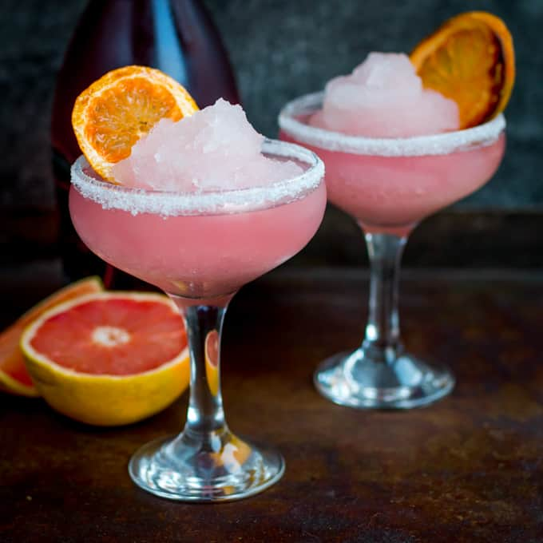

<body>

**Welcome!**

 Welcome to the website for Eilidh's hen party! 

Here you will find information on the various activities planned throughout the day. We are going to start with ceramics painting at <a href="https://www.ceramika.co.uk/" target="_blank">**Ceramika Art Studio**</a> at 2pm, before heading to <a href="https://www.carmelitehotels.com/" target="_blank">**The Carmelite Hotel**</a> for cocktail making at 4pm. Afterwards, the plan is to head for dinner at <a href="https://thespiritualistaberdeen.co.uk/" target="_blank">**The Spiritualist**</a> at 6.30pm. You can find a summary of the events alongside the associated costs <a href="approximatecosts.html" target="_blank">**here**</a>.

Feel free to come to some or all of the activities. Just let us know which you'd like to attend by filling in <a href="attendanceform.html" target="_blank">**this form!**</a>

Navigate through the tabs at the top of the page for information regarding the activities planned as well as their locations. For those coming to more than one part, we will all travel together between locations :)

&nbsp;

<table class="no-spacing" cellspacing="0" width="900">

<tr>
<td>

<a href="ceramika.html">
  
  
Ceramics

</td>
<td>

<a href="CocktailMaking.html">
  
  
Cocktail Making

</td>
<td>

<a href="dinner.html">
  
  
Dinner

</td>
<td>

<a href="attendanceform.html">
  
  
Ready to Party?

</td>
</tr>
</table>

</a>
</a>
</a>
</a>

</body>

