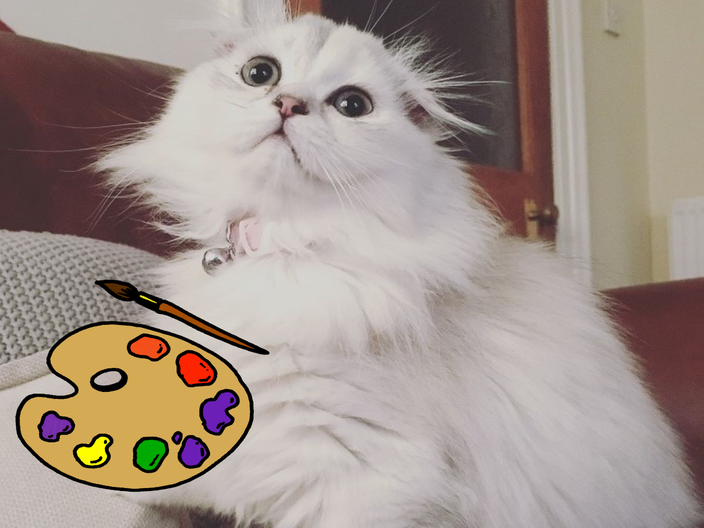

<body>

<html>
    <head>
    </head>
    <body>

**- Ceramics Painting -**

<table class="tablespacing2" cellspacing="0px" width="100%">
<tr>
<td>
  
</td>
<td>
  
</td>
<td>
  
</td>
<td>
  
</td>
<td>
  
</td>
</tr>
</table>

  
  
  
  

  
First up we are heading to ceramics painting at <a href="https://www.ceramika.co.uk/" target="_blank">**Ceramika Art Studio**</a>, located at 201 Hardgate, Aberdeen AB11 6YB.

  
Here we are going to take a ceramics painting class. This can get a little messy but we will be provided with aprons by Ceramika :) Alternatively, feel free to take along an old baggy t-shirt to wear over your clothes. You'll get to choose what to paint - they have a range of items including mugs and teapots!

We will also be taking along drinks and nibbles for everyone to graze on! For this activity, please take a long cash as each item has a slightly different cost (typically ranging from &#163;15 - &#163;20, although teapots are &#163;25).

  
  
  

  

  

<iframe width="350" height="350" id="gmap_canvas" src="https://maps.google.com/maps?q=ceramika%20art%20studio%20&t=&z=15&ie=UTF8&iwloc=&output=embed" frameborder="0" scrolling="no" marginheight="0" marginwidth="0"></iframe>

 

</body>